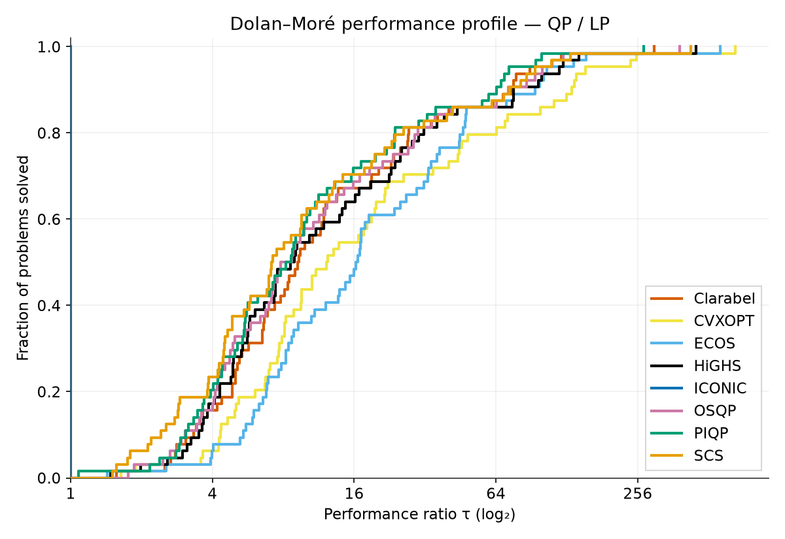
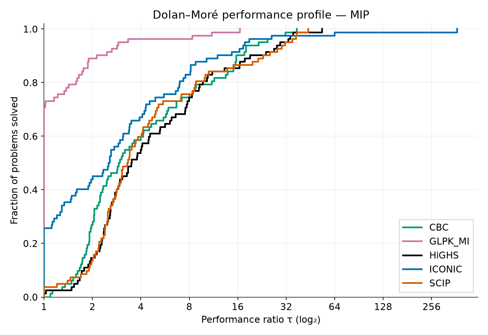

# ICONIC — Interior-Point Conic Optimization with Certificates

**ICONIC** is a high-performance convex optimization and mixed-integer programming solver written in pure Rust with a [CVXPY](https://www.cvxpy.org/) Python interface. It solves the canonical conic standard form using a regularized interior-point method with Mehrotra predictor-corrector and Gondzio centrality correctors.

```
minimize    ½ xᵀP x + qᵀx
subject to  A x + s = b,   s ∈ K
```

## What ICONIC Solves

| Cone | Status | Notes |
|------|--------|-------|
| Zero (equalities) | ✅ | Full presolve reduction |
| Nonnegative (LP/QP) | ✅ | Dense + sparse IPM, dual simplex fallback |
| Second-order (SOCP) | ✅ | NT scaling, O(d) arrow operations |
| PSD / SDP | ✅ | Kronecker O(k³) solve, general LMI |
| Exponential / Power / GenPower | ✅ | Nonsymmetric IPM, self-concordant barrier |
| Mixed-Integer (MIP) | ✅ | Branch-and-bound, cuts, heuristics, strong branching |

## Quick Start

### Rust
```sh
cargo build --release && cargo test --release
```

### Python / CVXPY
```sh
pip install iconic[cvxpy]
```
```python
import cvxpy as cp
from iconic._backend import register
register()
prob.solve(solver="ICONIC")  # LP / QP / SOCP / SDP / EXP / MIP
```

## Performance

ICONIC is **the fastest open-source QP/LP solver** on a diverse self-defined benchmark suite.

**QP/LP (89 instances, 8 solvers):**

| Solver | solved | SGM (ms) | vs ICONIC |
|--------|--------|----------|---------|
| **ICONIC** | 89 | **0.9** | 1.0× |
| PIQP | 89 | 4.8 | 5.5× |
| OSQP | 82 | 5.5 | 6.2× |
| SCS | 89 | 5.8 | 6.6× |
| Clarabel | 89 | 6.6 | 7.5× |
| HiGHS | 87 | 6.7 | 7.5× |
| ECOS | 84 | 7.9 | 8.9× |
| CVXOPT | 86 | 10.3 | 11.7× |



The profile is drawn over the 64 instances every solver solved; the SGM column is each
solver's own solved set.

**MIP (82 instances, 4 solvers):**

| Solver | solved | SGM (ms) | vs ICONIC |
|--------|--------|----------|---------|
| GLPK_MI | 82 | 5.7 | 0.10× |
| SCIP | 82 | 19.8 | 0.35× |
| HiGHS | 82 | 21.1 | 0.37× |
| **ICONIC** | 82 | **57.0** | 1.0× |



ICONIC's B&B engine still trails the established MIP solvers on this suite — it solves every
instance, but slower. The QP/LP/conic engines are where ICONIC leads.

### Benchmark Suite

The `iconic-bench` crate provides deterministic problem generators across 28 families (QP, LP, LASSO, NNLS, portfolio, SVM, Huber, MPC, SOCP, SDP, degenerate, ill-conditioned, plus 18 MIP classes). Run:

```sh
# QP/LP/conic only
cargo run --release -p iconic-bench -- run --reps 3

# With MIP
cargo run --release -p iconic-bench -- run --reps 3 --mip

# Multi-solver comparison (requires CVXPY + open-source solvers)
cargo run --release -p iconic-bench -- export-qp --out /tmp/qp.json --max-n 200
python3 scripts/bench_all_solvers.py --qp-json /tmp/qp.json --iconic-jsonl data.jsonl --out results.jsonl
python3 scripts/plot_benchmarks.py results.jsonl -o scripts/charts/
```

## Architecture

```
iconic/
├── iconic-core        # Problem types, cones, settings, solution
├── iconic-linalg      # Sparse CSC, LDLᵀ, faer backend, AMD ordering
├── iconic-presolve    # Equilibration, reduction, postsolve
├── iconic-ipm         # Cone-aware IPM (SOC + PSD + EXP + GenPower)
├── iconic-simplex     # Dual simplex for LP
├── iconic-mip         # Branch-and-bound MIP
├── iconic-api         # Unified Rust API
├── iconic-py          # PyO3 Python extension + CVXPY backend
├── iconic-bench       # Benchmark harness
└── scripts/         # Charts, multi-solver comparison
```

## License

Licensed under the Apache License, Version 2.0. See [LICENSE](LICENSE).
